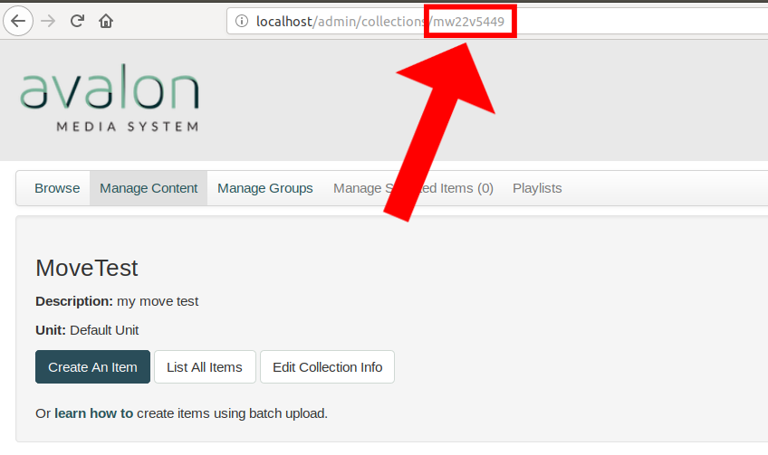

# avalon-archivematica-export

## Introduction

Are you at an institution that has been using Avalon and wants to start using
Archivematica?

Do you want to set up a preservation system so that you can ensure the digital
preservation of your existing media assets, or that your digital media assets
live in more than one place?

Or are you an IT Administrator and you want to safely migrate my media assets so
that I can sunset, refresh, or move your Avalon Media System instance? Do you
need to integrate Avalon into other systems and want to preserve the objects
during this process?

This is a workflow with example scripts for exporting video assets and
metadata out of Avalon for subsequent processing through
[Archivematica](https://www.archivematica.org/en/), a digital preservation system.

For processing through Archivematica and then Avalon, see [this documentation
page](https://wiki.dlib.indiana.edu/display/VarVideo/Archivematica+to+Avalon+Workflow).

Export mechanisms are set to work at the Collection level. The expectation here
is that a Collection is finalized and the assets are ready to be processed
through Archivematica and moved into long-term storage.

For new content and Collections being regularly updated, it is better to
establish a workflow through which content is being ingested into both
Archivematica and Avalon at the same time.

This strategy is targeting backlogs of access items that need to move into
preservation storage.

## ⚠ Can this workflow work for you?

This workflow depends on an Avalon instance being set up in a particular way
with regards to its original assets and the management of those assets. This
method, the "move to another location" method. This is not the default method of
handling assets. The default method is "none." There is also a "delete" option.
The other configuration options and they won’t allow for this workflow -- an
alternative will have to be determined, depending on how the original assets
were managed. The options are covered in the File Management section and
Managing Master Files section of the Avalon documentation. To figure out how
your system is configured, see the settings.yml file in the config folder.

This initial workflow and related documentation also assumes an Avalon instance
and assets stored on local disk -- not "in the cloud." This may work with
cloud-based assets, but may take extra configuration and time.

## Workflow

Portions of the workflow have supplemental example scripts written in [Ruby](https://www.ruby-lang.org/en/).
These scripts are meant to be examples and adjusted accordingly for custom
installations and issues.

The below workflow builds on each step, so make sure to follow the first one
carefully before moving on to the next. Each step has a script meant to be used
as an example. Scripts may be modified or reworked entirely, as long as the
output is what is expected.

### Get information

Before working with the files and data, certain information needs to be gathered
about the Avalon instance.

**Avalon URL**: This is the custom URL through which users access your Avalon instance.

**Collection ID**: This is the identifier for the Collection you want to retrieve
and send to Archivematica for processing. To get the Collection ID, select
Manage Collection from the administrator's dropdown menu in Avalon, click on the
desired collection, and get the ID from the URL.

See example photo below:



**Avalon API key**: To access the Avalon API, a key is needed. This is generated
via a `rake` task within Avalon.

An example command for generating the API key:
`rake avalon:token:generate username=archivist email=archivist1@example.com`

### Get Collection data

Requires: Avalon URL, Collection ID, Avalon API Key

The [get_collection_data.rb](example-scripts/get_collection_data.rb) script
utilizes the above gathered information: Avalon URL, Collection ID, and Avalon
API key. Running the script will prompt the user for each.

This script calls the Avalon API for all of the items in a collection, and
writes that resulting JSON query to file entitled `Avalon_Export_List.json`.
This JSON will be used in the following scripts to create a manifest, retrieve
item and media object data, and retrieve associated metadata.

Instead of running this script, you can retrieve the JSON from
`http://localhost/admin/collections/COLLECTION_ID_HERE/items.json` and saving
the contents of that API endpoint.

Output: A JSON file from a Collection's `items.json` API endpoint.

### Get Items list

Requires: `Avalon_Export_List.json`

Using the JSON retrieved from the
[get_collection_data.rb](example-scripts/get_collection_data.rb) script, the
[get_items.rb](example-scripts/get_items_.rb) script parses the data and creates
a list of all the file locations for each Media Object and pairs it with its associated
Item, and creating a manifest list of Items with containing filepaths.

Running the script will print the Items and associated files to screen for review.

The output should look like this:

```bash
Item 'Audio' ID: c247ds08x
  File: /moved/rb68xb84x-audio.mp3
  File: /moved/9z902z84b-another-audio.mp3
Item 'Archivematica Demo' ID: 4b29b596v
  File: /moved/3484zg88m-archivematica-demo.mkv
...
```

To run the script but save the results to a text file, you can pipe the results
of the script into a new document, like so:

`ruby get_items.rb > Item_Manifest.txt`

If the contents are as expected, you can move to the next step of the workflow.

### Retrieve and move Item's media objects

Requires: `Avalon_Export_List.json`

Media objects (files) need to be relocated from their temporary storage folder
into separate
Item-level folders. This can be done in various ways. There is an example
script, [move_items.rb](example-scripts/move_items.rb), that will move and
arrange files into corresponding folders based on JSON produced by the above
scripts. This example is simple, and will need to be customized to suit your
installation.

The most important thing that this script does is that it moves each file into a
corresponding Item folder, with the Item's ID. This allows for ingest into
Archivematica in appropriate sizes (Items instead of an entire Collection
without structural metadata) and it supports the below `move_metadata.rb` script.

System administrators may prefer to use a more powerful tool
such as `rsync` to migrate the media object files, especially if there are many
or if they are coming from a network-attached storage or cloud storage source,
to ensure that all media objects relocate successfully.

Output: Folders named after Item IDs for each Item

### Retrieve and move Item metadata

Requires: `Avalon_Export_List.json`, Avalon URL, Avalon API Key

Avalon uses MODS for descriptive metadata, and stores that information in an XML
document for each Item. This XML document can be downloaded and added as sidecar
metadata with each Item folder.

As above, the user is prompted for the following information: the
Avalon_Export_List.json created in the `get_collection_data.rb` script, the
Avalon site's URL, and the Avalon API key for making the query.

This script assumes that files representing media objects have been arranged
into folders with their parent Item's name, and all of those files sit within
the same folder. This script will retrieve MODS.xml for each media object and
place it in the same directory with its Item's name and with its filename
matching its corresponding media object's Fedora ID.

Output: MODS.xml with file ID set inside of folder with Item ID.

### Archivematica 

After the assets and the contents have been retrieved and arranged, they are
then ready for ingest into Archivematica.

For general workflow and installation guidelines, and help with setting up
Archivematica, see the [Archivematica documentation](https://www.archivematica.org/docs).
